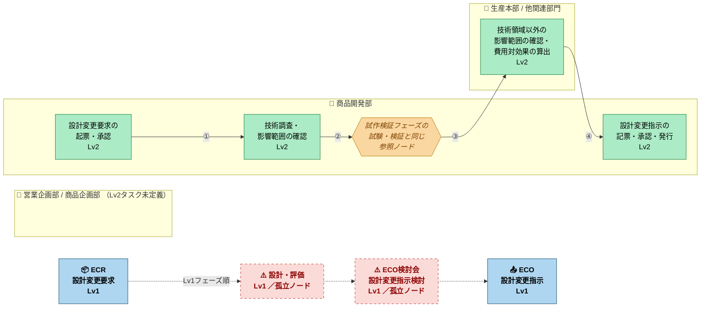

# 設計変更プロセス 業務フロー Lv.1 + Lv.2

**ソースファイル:** `2-6_新業務フロー(Lv.1+2)_設計変更プロセス（含む：1-3,2-5）.xlsx`  
**シート名:** 設計変更プロセス業務フロー L1・L2

---

## フロー図



---

## バリデーション結果

**ステータス: `FLAGGED`** — 論理エラー 4件

| # | 種別 | 対象ノード | 詳細 |
|---|------|-----------|------|
| 🔴 1 | 孤立ノード | `設計・評価` [ID:19] | Lv1フェーズブロック。明示コネクタなし。 |
| 🔴 2 | 孤立ノード | `ECO（設計変更指示）検討会` [ID:13] | Lv1フェーズブロック。明示コネクタなし。 |
| 🟠 3 | 開始ノード未定義 | フロー全体 | Start シンボルが存在しない。 |
| 🟠 4 | 終了ノード未定義 | フロー全体 | End シンボルが存在しない。 |

---

## 確認済み接続チェーン

```
設計変更要求の起票・承認
    ↓ ① コネクタ #206
技術調査・影響範囲の確認
    ↓ ② コネクタ #31
試作検証フェーズの「試験・検証」と同じ  ← 参照ノード（2-5 他フロー）
    ↓ ③ コネクタ #36
技術領域以外の影響範囲の確認・費用対効果の算出  [生産本部]
    ↓ ④ コネクタ #39
設計変更指示の記票・承認・発行
```

---

## 凡例

| 色 | 種別 |
|----|------|
| 青 (実線) | Lv1 フェーズ |
| 赤 (破線) | Lv1 孤立ノード（要修正） |
| 緑 | Lv2 業務タスク |
| 黄 | 参照ノード（他フローへ） |
